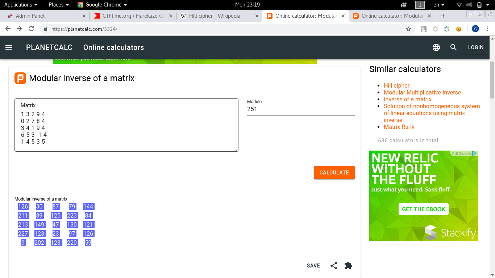

# Once Upon A Time

Now!! Let the games begin!!

[problem.py](problem.py)

[result.txt](result.txt)

Basically its a [Hill Cipher](https://en.wikipedia.org/wiki/Hill_cipher)

According to Wikipedia, to decrypt we need to inverse the key matrix

Encrypt the cipher text with the inverse key matrix, we will get the plaintext!

According to the code, the key matrix is:
```
[[1,3,2,9,4], 
 [0,2,7,8,4], 
 [3,4,1,9,4], 
 [6,5,3,-1,4], 
 [1,4,5,3,5]]
```
Using [online inverse matrix](https://planetcalc.com/3324/) we can easily inverse it:



Change the orginal key to inverse key:
```python
m2 = [[126,30,87,79,144], [211,89,125,223,84], [213,149,47,130,121], [227,123,23,97,126], [9,202,123,220,59]]
```
Change the flag to cipertext:
```python
# flag = re.findall(r'HarekazeCTF{(.+)}', flag)[0]
flag = 'ea5929e97ef77806bb43ec303f304673de19f7e68eddc347f3373ee4c0b662bc37764f74cbb8bb9219e7b5dbc59ca4a42018'
flag = codecs.decode(flag,"hex")
# print(flag)
```
Remove the hexlify:
```python
enc_flag = encrypt(m1, m2)
print(enc_flag)
```
Run it with `python3` and we get the flag!!
```bash
# python3 solve.py 
Encrypted Flag:
b'Op3n_y0ur_3y3s_1ook_up_t0_th3_ski3s_4nd_s33%%%%%%%' # Ignore the %
```

[Full Script](solve.py)

## Flag
> HarekazeCTF{Op3n_y0ur_3y3s_1ook_up_t0_th3_ski3s_4nd_s33}